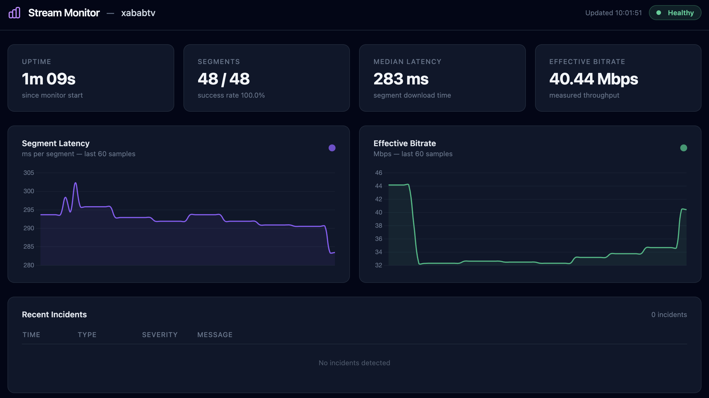

# twitch-stream-healthcheck

> Is this stream working right now, and if not, why?


**Status: Work in progress**

---

> Big thanks to the contributors of [TwitchDownloaderCLI](https://github.com/lay295/TwitchDownloader) for the hard Twitch reverse-engineering work. I used it to figure out how to talk to Twitch (playback access token flow, Usher URL construction).

---



A Python CLI and web dashboard that monitors the health of a live Twitch stream in real time. It parses the HLS playlist, downloads and times individual segments, detects anomalies (stalls, bitrate drops, sequence gaps, HTTP errors), and reports through a structured log, a JSON report, a rich-powered CLI, and a FastAPI + Chart.js web dashboard.

It does **not** download or store video. Segments are fetched, timed, then discarded.

## Installation

**Requirements:** Python 3.11+, [uv](https://github.com/astral-sh/uv) or pip.

```bash
git clone https://github.com/your-org/twitch-stream-healthcheck
cd twitch-stream-healthcheck

# Create a virtual environment and install
python -m venv .venv
source .venv/bin/activate
pip install -e .
```

For development dependencies (pytest, ruff, mypy, respx):

```bash
pip install -e . pytest pytest-asyncio pytest-cov ruff mypy respx
# or with uv:
uv pip install -e . --group dev
```

## Usage

### CLI

```bash
# One-shot health check: variants, 3 segments, overall status
twitch-healthcheck check kaicenat

# Continuous monitoring for 2 minutes, save a JSON report
twitch-healthcheck monitor kaicenat --duration 120 --output report.json

# Monitor a specific quality
twitch-healthcheck monitor kaicenat --quality 720p60 --duration 60

# Pretty-print a saved JSON report
twitch-healthcheck report report.json

# Show version
twitch-healthcheck --version
```

**Exit codes for `check` and `monitor`:**

| Code | Meaning |
|------|---------|
| `0`  | Healthy |
| `1`  | Degraded (some segment failures) |
| `2`  | Down or offline |

### Web dashboard

```bash
# Default channel (kaicenat)
TWITCH_CHANNEL=kaicenat uvicorn dashboard.api:app --reload

# Or via the helper script
TWITCH_CHANNEL=kaicenat ./scripts/run_dashboard.sh
```

Open **http://localhost:8000** in your browser. The dashboard connects automatically via WebSocket and updates every second.

## How it works

### 1. Twitch API — getting the playlist URL

Twitch does not expose a public HLS URL directly. The tool replicates what the Twitch web player does:

1. POST to `https://gql.twitch.tv/gql` with a `streamPlaybackAccessToken` GraphQL query using Twitch's public web Client-ID.
2. Use the returned signed token and signature to build the Usher URL (`usher.ttvnw.net`), which resolves to the HLS master playlist.

No authentication or Twitch account is required — only public playback tokens.

### 2. HLS parsing

An HLS stream is described by two types of `.m3u8` files:

- **Master playlist** — lists all available quality variants (1080p60, 720p60, 480p…) with their bandwidth and resolution.
- **Media playlist** — a sliding window of the last N segments (typically ~6 × 2s segments), updated every `target_duration` seconds.

The tool parses both using the `m3u8` library and builds typed Pydantic models.

### 3. Monitoring loop

The `StreamMonitor` runs an async loop:

1. Fetches the media playlist every `target_duration` seconds (default: 2s for Twitch).
2. Identifies new segments by sequence number (deduplication via a seen-set).
3. Downloads each new segment to memory, times it, measures effective bitrate, then discards the content.
4. Records a `SegmentMeasurement` per segment in a rolling buffer of the last 60 measurements.

### 4. Anomaly detection

Four independent detectors run over the measurement buffer:

| Detector | Triggers when | Severity |
|----------|--------------|----------|
| `detect_http_errors` | Any segment returns HTTP ≥ 400 or a connection error | Warning (4xx) / Critical (5xx, network) |
| `detect_stalls` | Gap between two consecutive successful downloads exceeds 2× `target_duration` | Critical |
| `detect_bitrate_drops` | Effective bitrate falls below 50% of the variant's advertised bandwidth for 3+ consecutive segments | Warning |
| `detect_gaps` | Segment sequence number jumps by more than 1 between consecutive measurements | Warning |

All thresholds are configurable via `DetectionConfig`.

### 5. Output

- **CLI (`check`)** — rich table of variants + per-segment measurements + colored status.
- **CLI (`monitor`)** — live `rich.Live` panel with metrics and incident feed, optional JSON report on exit.
- **Dashboard** — FastAPI app serving a Tailwind + Chart.js SPA. Metrics pushed via WebSocket every second.

## Architecture

```
src/twitch_healthcheck/
├── cli.py          Typer CLI (check / monitor / report commands)
├── twitch_api.py   GQL token fetch + Usher URL construction
├── hls.py          HLS master + media playlist parser
├── monitor.py      Async polling loop, rolling buffer, snapshot
├── detectors.py    Pure anomaly detectors (http_error, stall, bitrate_drop, gap)
├── report.py       Output formatting (reserved)
├── models.py       Pydantic v2 models shared across all modules

dashboard/
├── api.py          FastAPI app, /api/snapshot, /ws/metrics WebSocket
└── static/
    ├── index.html  Single-page dashboard (Tailwind CDN)
    └── app.js      WebSocket client + Chart.js real-time updates

tests/
├── fixtures/       Real .m3u8 samples (Twitch-style playlists)
├── test_models.py
├── test_hls.py
├── test_twitch_api.py
├── test_monitor.py
├── test_detectors.py
├── test_cli.py
└── test_dashboard_api.py
```

## Development

```bash
# Lint
ruff check src/ tests/

# Format
ruff format src/ tests/

# Type check
mypy src/

# Run all tests
pytest

# Run a specific test file
pytest tests/test_hls.py -v

# Run only tests matching a keyword
pytest -k "stall" -v
```

## Tests

The test suite has no external dependencies — all HTTP calls are mocked with [respx](https://lundberg.github.io/respx/).

```
tests/test_models.py        27 tests — Pydantic model validation
tests/test_hls.py           26 tests — HLS playlist parser
tests/test_twitch_api.py    16 tests — Twitch GQL + Usher URL
tests/test_monitor.py       21 tests — monitoring loop
tests/test_detectors.py     39 tests — anomaly detectors
tests/test_cli.py           24 tests — Typer CLI commands
tests/test_dashboard_api.py 14 tests — FastAPI routes + static files
```

## What this project does NOT do

- Store or decode video. Segments are downloaded to memory and immediately discarded.
- Support Twitch VODs (past broadcasts). Live streams only.
- Implement alerting (webhooks, email). Output is machine-readable; alerting is a downstream concern.
- Require Twitch authentication. Public playback tokens only.
- Check frame-level quality. Monitoring stays at the transport layer.
